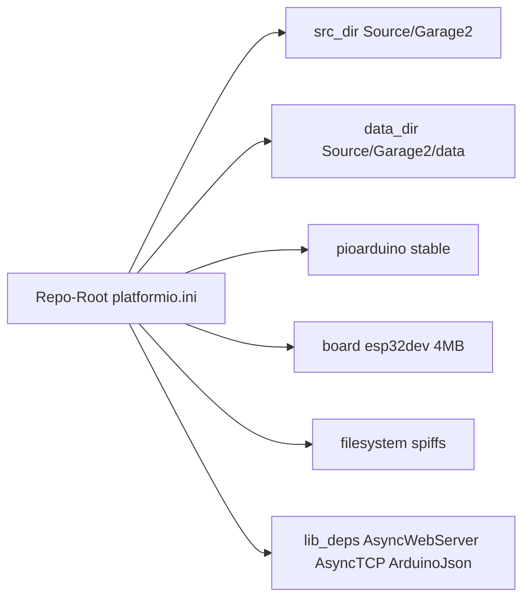

# Umstellung auf pioarduino (ohne Codeänderung)

## Ausgangslage

- Firmware liegt unter [`Source/Garage2/`](Source/Garage2/) als Arduino-Sketch (`.ino` + `.cpp/.h` + `data/`).
- Bisher: Arduino IDE + manuelle Libraries, kein `platformio.ini`.
- Hardware-Annahme: **ESP32-WROOM-32U**, **4 MB Flash**, **kein PSRAM** → Board-Profil `esp32dev`.
- Constraint: **keine Änderungen am Anwendungscode**; SPIFFS bleibt trotz Deprecation.

## Ansatz

Nur Projekt-/Build-Konfiguration ergänzen. Quellcode unter `Source/Garage2/` unverändert lassen (inkl. `#include <SPIFFS.h>`, Legacy-ADC `driver/adc.h`, `ESPAsyncWebServer`).



## Konkrete Schritte

### 1. `platformio.ini` im Repo-Root anlegen

Neue Datei [`platformio.ini`](platformio.ini) mit etwa:

```ini
[platformio]
src_dir = Source/Garage2
data_dir = Source/Garage2/data

[env:esp32dev]
platform = https://github.com/pioarduino/platform-espressif32/releases/download/stable/platform-espressif32.zip
board = esp32dev
framework = arduino
monitor_speed = 115200
board_build.flash_size = 4MB
board_build.filesystem = spiffs
board_build.partitions = default.csv
lib_deps =
  bblanchon/ArduinoJson @ ^6.21.5
  ESP32Async/ESPAsyncWebServer
  ESP32Async/AsyncTCP
```

Begründung der Festlegungen:

- **pioarduino stable** statt offiziellem `espressif32` (aktueller Arduino-ESP32-Core).
- **`esp32dev` + `4MB`**: passt zu WROOM-32U ohne PSRAM; „U“ (U.FL) braucht kein eigenes Board-JSON.
- **`board_build.filesystem = spiffs`**: überschreibt den LittleFS-Default von pioarduino; bestehender SPIFFS-Code und Workflow bleiben gültig.
- **`default.csv`**: klassisches 4 MB-Schema mit OTA-Slots (ArduinoOTA bleibt nutzbar).
- **ArduinoJson ^6**: Code nutzt `StaticJsonDocument<512>` (v6-API); kein Zwang zu v7.
- **ESP32Async/\***: API-kompatibel zu `#include <ESPAsyncWebServer.h>` unter Core 3.x.

### 2. `.gitignore` ergänzen

Einträge für PlatformIO-Artefakte, z. B. `.pio/`, `.vscode/.browse.c_cpp.db*`, damit Build-Caches nicht ins Repo wandern. Bestehende Einträge unangetastet lassen.

### 3. README kurz um Build-Befehle erweitern

In [`README.md`](README.md) einen kurzen Abschnitt „Build mit pioarduino“:

- Extension/CLI-Voraussetzung (pioarduino IDE bzw. PlatformIO-CLI)
- `pio run`
- `pio run -t upload`
- `pio run -t uploadfs` (SPIFFS-Image aus `Source/Garage2/data/`)
- `pio device monitor`

Keine inhaltliche Umbau-Doku zu LittleFS/ADC.

### 4. Build verifizieren (ohne Code-Patches)

Lokal prüfen:

1. `pio run` — muss mit unverändertem Sketch kompilieren.
2. Bei Erfolg: Upload + `uploadfs` gegen das Board (wenn angeschlossen).
3. Smoke: SoftAP/Web-UI, `/raw_adc`, Relais-Impuls, OTA nur wenn gewünscht.

## Bewusst nicht in diesem Schritt

- Keine Umstellung SPIFFS → LittleFS
- Keine ADC-Migration (`adc1_*` → `analogRead` / `adc_oneshot`)
- Kein Refactor der Sketch-Struktur (`.ino` bleibt)
- Kein Branch-/Git-Commit, außer du forderst das später an

## Risiko / Fallback

Unter Arduino Core 3.x / IDF 5.x sind Legacy-ADC und SPIFFS oft noch kompilier- und lauffähig (Warnungen möglich). Sollte der **erste** `pio run` hart an ADC/SPIFFS/Async-Libs scheitern, stoppen wir und planen gezielt minimale Anpassungen — nicht vorab im Code ändern.

## Erfolgskriterium

- Repo baut mit pioarduino über `platformio.ini`.
- Anwendungscode unter `Source/Garage2/` unverändert.
- SPIFFS weiterhin das verwendete Filesystem (`uploadfs` / Runtime).
