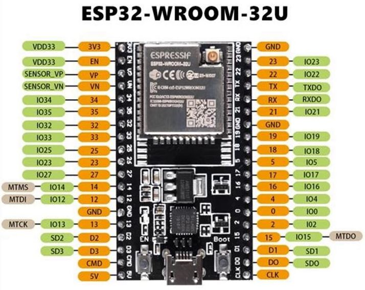

# Bilder der aktuellen Installation
## Übersicht
Lochrasterplatine mit ESP32U-Board und Relais im Kunststoffgehäuse an der Garagenwand.
Der rechte Kabelkanal führt zum Winkelgeber (Spannungsteiler-Poti).

## Detailansicht Box
Rechtes schwarzes Kabel ist führt zur externen WLAN-Antenne vor dem Metall-Tor.
Wie man 2,4Ghz-WLAN-Antenne selber machen kann, zeigt folgendes [YouTube-Video](https://www.youtube.com/watch?v=bs8hvXGJdhM)

## Detailansicht Platine

##Winkelgebergehäuse
3D-Gedrucktes Gehäuse; CAD und STL-Daten im Verzeichnis [Winkelgeber-Gehaeuse](../Winkelgeber-Gehaeuse).
Der quadratische Mitnehmer-Block auf der Poti-Welle läuft locker im U-Profil der Tor-Aufhängung.
Das Gehäuse ist an die Wand geklebt.

## Pin-Out meines ESP32U
"U" = externer Antennenanschluß.

## Schaltbild
Das Schaltbild, sowie eine kleine Stückliste in Verzeichnis [Schematics](../Schematics).

