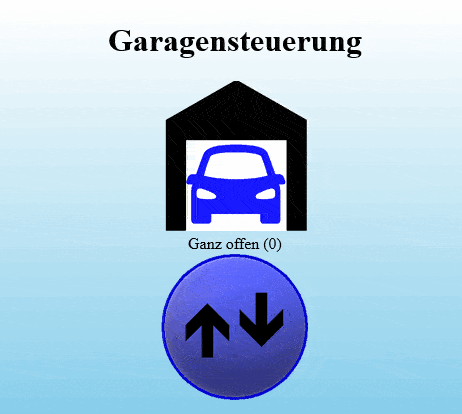
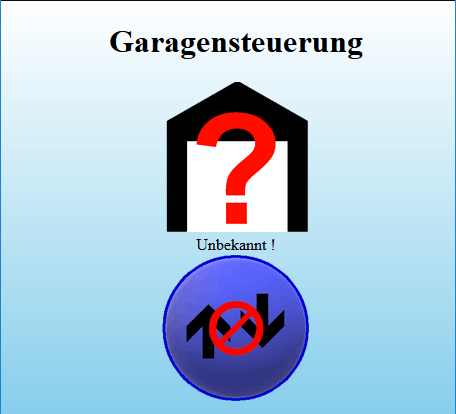
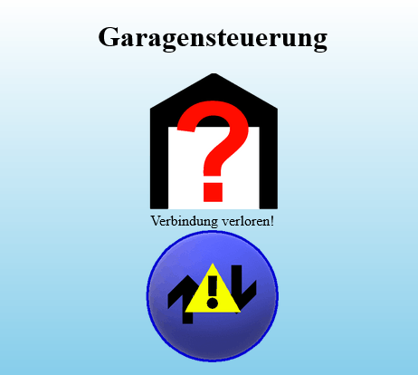
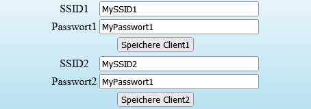

# Garage2
Garagentorsteuerung mit ESP32 und Web-Frontend

Dieses Projekt ergänzt die Handsender eines SOMFY Garagentorantriebs um ein Web-Frontend, welches per Mobil-Telefon oder PC-Browser angesprochen werden kann.
Dabei läuft auf einem ESP32 ein Web-Server, welche die Tor-Stellung anzeigt und durch einen virtuellen Button ein Impuls an den Garagentorantrieb gibt.
Im Endeffekt wird der manuelle Schalter durch den ESP32 betätigt.

Die Torstellung wird dabei durch einen Spannungsteiler (10k Poti) an einem der ADC-Eingänge des ESP32 realisiert.
CAD+STL Daten für Winkelgebergehäuse finden sich im Verzeichnis [Winkelgeber-Gehaeuse](/Winkelgeber-Gehaeuse)

Durch das web-Frontende und entsprechende HTTP-GET und HTTP-POST Aufrufe, lässt sich diese Garagentorsteuerung dann auch via Home-Automation-Systeme (z.B. NodeRED) in andere Grafische Front-Ends integrieren.

# Ansicht im Web-Browser
## Animation mit simuliertem Push-Button

## Fehlerbilder
Temporärer Verbindungverlust: einzelne Statusabfragen an den Garagen-Server blieben ohne Antwort (Status also unbekannt).
Das Browser-Skript versucht aber weiterhin den Status abzufragen.
Ohne gültigen Garagen-Status wird der Button blockiert; symbolisiert durch Verbotszeichen).



Dauerhafter Verbindungsverlust: Laufen mehrere Status-Abfragen an den Garagen-Server ins Leere (erhalten kein Antwort), dann wird das Abfrage-Skript im Browser komplett beendet und die Button-Abfrage dauerhaft deaktiviert.
In diesem Zusatnd erfolgt kein selbständiger Re-Connect zum Server; dies muss manuell durch ein Reload (Erneut laden) in Browser angestossen werden.




# URL Aufrufe
## Basis-Aufruf
Hat sich der ESP in Ihrem WLAN-Netz angemeldet, erfolgt der aufruf über die erhaltenen IP-Adresse oder den Hostnamen...

[http://garage](http://garage)  oder beispielhaft [http://192.168.178.70](http://192.168.178.70)
## Aufruf im Access-Point (AP) Modus
Sollte der ESP32 keine WLAN-Verbindung bekommen schaltet er automatisch zuusätzlich einen AP frei.
- Standard AP SSID: ***Garage_AP***
- Standard AP Pass: ***garage_pass***

Diese Vorgaben sind in der Datei [config.json](Source/Garage2/data/config.json) hinterlegt. Eine Änderung via [Config-Menü](README.md#konfiguration-zur-laufzeit) zur Laufzeit ist nicht vorgesehen.

Somit kann dann z.B. mit dem Mobil-Telefon nach der SSID "Garage_AP" gesucht und mit Passwort "garage_pass" ein Verbindung hergestellt werden. Falls Sie nicht direkt auf die Konfigurations-Seite gelangen (Landing Page), dann im Web-Browser irgendeine Web-Adresse eingeben. Der integrierte DNS-Server liefert immer die selbe URL zurück.

## Konfiguration zur Laufzeit
Ergänzen Sie den [Basis-Aufruf](#basis-aufruf) um "/config" und Sie gelangen ins Konfigurations-Menü.

z.B. [http://garage/config](http://garage/config)  oder beispielhaft [http://192.168.178.70/config](http://192.168.178.70/config)




SSID und Passwort von bis zu 2 Access-Points. Die Garagensteuerung versucht nacheinander einen der beiden AP zu kontaktieren. Sind SSID und Passwort leer, dann wird dieser Eintrag übersprungen. Die Settings für SSID1 und SSID2 können getrennt mit den entsprechenden Button gespeichert werden.


Hostname, der zum Login an vorhandes WLAN benuztzt wird (falls vom Access-point unterstützt; sonst im Router konfigurieren).


Die Werte des Analaog-Digital-Converters dienen zur grafischen Darstellung der Torstellung. Dabei ist es egal, wie der Poti verdrahtet ist, also ob ***door_up***&nbsp;>&nbsp;***door_down*** oder ***door_up***&nbsp;<&nbsp;***door_down***. Dies wird von der Software bereücksichtigt. Um die Konfiguration zu vereinfachten, kann der aktuelle ADC-Wert per Button ausgelesen und ins entsprechende Feld eingetragen werden. Sprich: Tor in entsprechende Stellung fahren und Wert auslesen durch ***Akt. ADC Wert***.
<table>
  <tr>
    <td></td>
    <td><b><i>ADC-Wert</i></b><br>
                       &nbsp;&nbsp;&nbsp;&nbsp;&nbsp;&nbsp;Door_Up<br>
      .<br>
                       &nbsp;&nbsp;&nbsp;&nbsp;&nbsp;&nbsp;Door_Middle<br>
      .<br>
                       &nbsp;&nbsp;&nbsp;&nbsp;&nbsp;&nbsp;Door_Down<br>
      .
    </td>
  </tr>
  <tr>
    <td></td>
    <td>.<br>
                       &nbsp;&nbsp;&nbsp;&nbsp;&nbsp;&nbsp;Door_Up<br>
      <b><i>ADC-Wert</i></b><br>
                       &nbsp;&nbsp;&nbsp;&nbsp;&nbsp;&nbsp;Door_Middle<br>
      .<br>
                       &nbsp;&nbsp;&nbsp;&nbsp;&nbsp;&nbsp;Door_Down<br>
       .
    </td>
  </tr>
  <tr>
    <td></td>
    <td>.<br>
                       &nbsp;&nbsp;&nbsp;&nbsp;&nbsp;&nbsp;Door_Up<br>
      .<br>
                       &nbsp;&nbsp;&nbsp;&nbsp;&nbsp;&nbsp;Door_Middle<br>
      <b><i>ADC-Wert</i></b><br>
                       &nbsp;&nbsp;&nbsp;&nbsp;&nbsp;&nbsp;Door_Down<br>
      .
    </td>
  </tr>
  <tr>
    <td></td>
    <td>.<br>
                       &nbsp;&nbsp;&nbsp;&nbsp;&nbsp;&nbsp;Door_Up<br>
      .<br>
                       &nbsp;&nbsp;&nbsp;&nbsp;&nbsp;&nbsp;Door_Middle<br>
      .<br>
                       &nbsp;&nbsp;&nbsp;&nbsp;&nbsp;&nbsp;Door_Down<br>
      <b><i>ADC-Wert</i></b>
  </tr>
</table>

# Hard-Coded Konfiguration
Folgende Daten sind fest im Programm hinterlegt und vor dem Compiler-Aufruf anzupassen. Eine Änderung während der Laufzeit ist nicht möglich.
## Version Info
Datei: [_sketchversion.h](Source/_sketchversion.h)
```
#define SKETCHNAME    "Garagensteuerung"
#define SKETCHVERSION "$Ver 2.0"
#define SKETCHDATE    "2022-02-06"
```
Versions Informationen, die mittels `http://garage/version` abgefragt werden können; zusätzlich Datum/Zeit des Compiler-Runs

## OTA Update Passwort (Over-The-Air Update Passwort)
Datei: [myArduinoOTA.h](Source/myArduinoOTA.h)
```
#define PASSWORD_HASH  "f8695e6ee86ea0b76ebbbe9023f6ae70"; // MD5-Hash
// oder
#define PASSWORD_TEXT  "Garagensteuerung!";                // Passwort im Klartext
```
Over-The-Air Update via ArduinoIDE; Passwort als MD5-Hash *oder* im Klartext

## Hardware: Relais, LED, ADC...
Datei: [hardwareRelated.h](Source/hardwareRelated.h)
```    
const int            cfg_relais_pin    = 25;             //  An diesem Pin hängt das Relais....
const int            cfg_relais_active = LOW;            // Schliesst das Relais bei LOW oder HIGH ?

const int            cfg_signal_led    = 13;             //  An diesem Pin hängt die Signal-LED
const int            cfg_signal_active = HIGH;           //  Leuchtet die LED bei HIGH oder LOW?

const adc1_channel_t cfg_adc_input     = ADC1_CHANNEL_4; //  ADC-Kanal hier: ADC1 channel 4 an GPIO32   
```
# Integration in Home-Automation-Systeme
Im Folgenden ein paar nutzliche URL-Aufrufe, die zur Integration in Systeme wie [Node-RED](https://nodered.org/) benutzt werden.
Für die Beispiele wird von einen Hostnamen "garage" ausgegangen.
### Data: ***Version***
- HTTP-URL: http://garage/version
- HTTP-Methode: *GET*
- HTTP-Parameter: ---
- Response-MIME-Type: *text/plain*
- Bemerkung: Versions-Informationen aus [_sketchversion.h](Source/_sketchversion.h) und Kompilierungsdatum
- Beispiel-Ausgabe:<br> `Garagensteuerung $Ver 2.0.1 (2022-03-26)\n Compiled 2022-03-26 - 17:00:19`

### Data: ***RSSI-Wert***
- HTTP-URL: http://garage/raw_rssi
- HTTP-Methode: *GET*
- HTTP-Parameter: ---
- Response-MIME-Type: *text/plain*
- Bemerkung: Gibt den RSSI der WiFi-Verbindung zurück.
- Beispiel-Ausgabe: `-80`

### Data: ***ADC-Wert***
- HTTP-URL: http://garage/raw_adc
- HTTP-Methode: *GET*
- HTTP-Parameter: ---
- Response-MIME-Type: *text/plain*
- Bemerkung: Gibt den aktuellen Wert des Analog-Digital-Converters zurück und damit Winkelstellung des Tores.
- Beispiel-Ausgabe: `4095`

### Data: ***Tor-Stellung***
- HTTP-URL: http://garage/doorlevel
- HTTP-Methode: *GET*
- HTTP-Parameter: ---
- Response-MIME-Type: *text/plain*
- Bemerkung: Ein Wert zwischen 0 und 3, der die aktuelle Stellung des Tores darstellt. Man könnte auch "bewerteter ADC-Wert" sagen.
  - 0 = komplett offen
  - 1 = nicht ganz offen
  - 2 = nicht ganz geschlossen
  - 3 = komplett geschlossen
- Beispiel-Ausgabe: `0`


